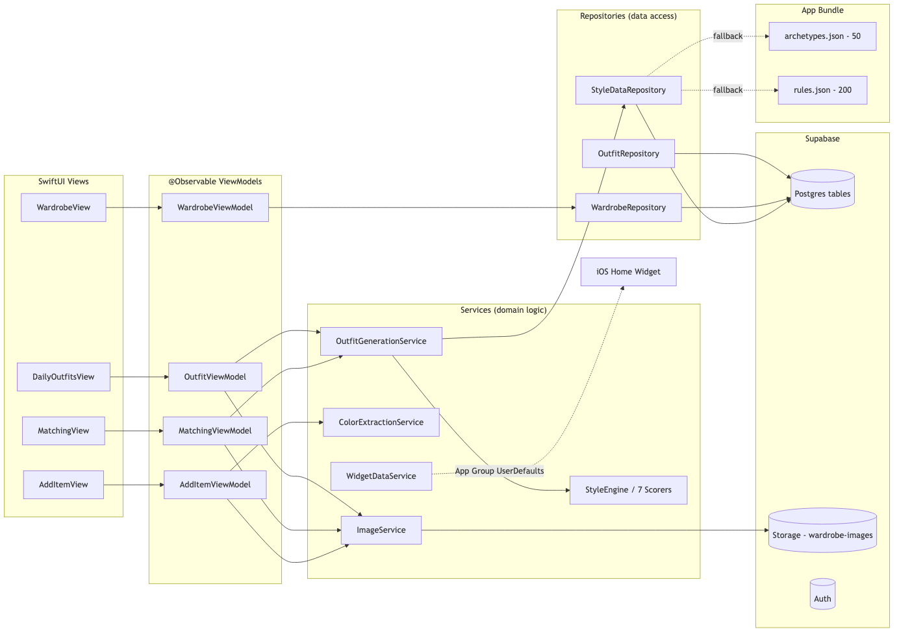

# Wardrobe Re-Do

iOS-native wardrobe decision engine — generates daily styled outfit suggestions from photos of your own clothing using a 7-dimension style engine grounded in professional fashion theory.



[](https://developer.apple.com/ios/) [](https://swift.org) [](#tests) [](LICENSE)

> **Status:** Solo project, built in public. TestFlight Build 51 shipped; the **TF52 "Fast Add" (≤10s tagging)** work is on `main` behind the `isFastAddEnabled` flag. 961 tests green (Fast plan).
>
> **Repo model:** single public repo, built in the open. **`main` is the latest development line** (the newest code — not an old release snapshot); released builds are tagged. New work lands via short-lived `feat/*` / `fix/*` / `chore/*` PRs. See [`ARCHITECTURE.md`](ARCHITECTURE.md) for the layering + where new code goes, and [`CONTRIBUTING.md`](CONTRIBUTING.md) for conventions and the dev loop.

---

## Why I built this

Existing wardrobe apps stop at digital-closet bookkeeping — they show you what you own, then leave the styling decisions to you. The interesting problem is the other direction: given the clothes I already own, what's a *good* outfit for today?

That problem sits at the intersection of three things I wanted to learn end-to-end:

- **Fashion theory as a domain model.** Professional stylists rely on real heuristics (color harmony rules, the "third-piece" rule, formality coherence, occasion matching). Encoding those into a scoring system surfaced design questions a typical CRUD app never raises — how do you weight conflicting rules, how do you make the engine explain itself, when do you trust personal preference over the rule.
- **On-device ML where privacy is the product.** Clothing photos are intimate data. Sending them to a server for inference is a non-starter — so the entire visual pipeline (multi-garment detection, attribute classification, color extraction) had to run on the iPhone's Neural Engine. That constraint forced real engineering: model selection (RF-DETR-Seg fine-tuned on Fashionpedia), palettization, Core ML export, on-device benchmarking, fallback paths when the model is uncertain.
- **iOS as a shipping target, not a sandbox.** SwiftUI + `@Observable` + SwiftData are still moving targets in iOS 17/18; getting a real app through TestFlight (590+ tests, structured logging, telemetry opt-in, crash reporting, idempotent uploads) was a forcing function for production discipline.

The repo is the audit trail of that learning — every PR has a focused scope, every architectural choice has a write-up under [`docs/`](docs/), and every research dead-end is documented under [`.build5-research/`](.build5-research/) instead of being deleted.

---

## What it does

Two user-facing flows on top of a beam-search outfit generator:

1. **Outfits — "Today's Outfits"**. One tap generates three styled outfits given a chosen occasion (casual / work / date / formal / athletic / lounge). Results stable across launches (stored per day).
2. **Match — "What goes with this?"**. Pick a hero item from the wardrobe; the engine returns the five best outfits built around it.

Photos in → structured style metadata out (color, texture, fit, formality, sub-category) → scored across 7 independent style dimensions → outfits.

## Architecture

```
View (SwiftUI) → ViewModel (@Observable) → Service → Repository → Supabase / SwiftData
```

- **MVVM + Repository + Service.** ViewModels own UI state; Services encapsulate domain logic (style engine, image processing); Repositories handle data access.
- **On-device ML for privacy.** No clothing images leave the device for inference — multi-garment detection (RF-DETR-Seg fine-tuned on Fashionpedia) and the attribute classifier both run via Core ML on-device.
- **Tier-A resilience.** Retry, local cache, upload queue, idempotency keys — the app stays useful when the network doesn't.

See [`docs/ENGINE.md`](docs/ENGINE.md) for the full engine reference and [`docs/diagrams/`](docs/diagrams/) for architecture diagrams.

## Stack

| Layer | Technology |
|-------|-----------|
| UI | SwiftUI (iOS 17+, `@Observable`) |
| State | `@Observable` ViewModels, SwiftData local cache |
| Backend | Supabase — PostgreSQL, Auth, Storage, Edge Functions |
| On-device ML | Core ML + Vision (RF-DETR-Seg multi-garment, attribute classifier) |
| Image loading | Kingfisher |
| Crash reporting | Sentry (opt-in) |
| Telemetry | Supabase `ml_inference_telemetry` (opt-in) |
| Tests | XCTest — 595 unit + 3 integration |

Dependencies via Swift Package Manager only. No CocoaPods, no Carthage.

## Style engine — 7 scoring dimensions

Each candidate outfit is scored independently across:

1. **Proportion balance** (0.15) — silhouette pairing
2. **Color harmony** (0.25) — 3-color max, 60-30-10 rule, value contrast
3. **Texture mix** (0.10) — 2-3 textures, visual weight balance
4. **Formality coherence** (0.15) — multi-dimensional formality
5. **Outfit formula** (0.15) — hero piece, 2-of-3 matching, third-piece rule
6. **Seasonal/occasion fit** (0.10) — temperature, dress code
7. **Personal preference signal** (0.10) — learned from user feedback

Weights are not magic numbers — see [`docs/ENGINE.md`](docs/ENGINE.md) §3 for the rationale and tuning history.

## Engineering highlights

- **Beam-search outfit generator** over a library of 50 style archetypes and 200 combination rules. See [`docs/diagrams/06-beam-search.png`](docs/diagrams/06-beam-search.png).
- **Multi-garment detection on-device.** RF-DETR-Seg-Small fine-tuned on Fashionpedia, palettized to ~50 MB, exported to Core ML. Runs on Apple Neural Engine.
- **K-means color extraction** with a perceptually weighted hue wheel. See [`docs/diagrams/03-kmeans.png`](docs/diagrams/03-kmeans.png) and [`docs/diagrams/04-hue-wheel.png`](docs/diagrams/04-hue-wheel.png).
- **Auto-attribute pre-fill** with a confidence floor (0.80) — predictions below threshold show no guess rather than a wrong one. See [`WardrobeReDo/Config/AttributePrefill.swift`](WardrobeReDo/Config/AttributePrefill.swift).
- **Feature flags + Developer menu** for staged rollout of detection/classifier and telemetry opt-in.
- **Self-hosted CI** on macOS/ARM64 — full test suite + build artifacts on every PR.

## Engineering patterns documented in this repo

- [`docs/patterns/gpu-budget-math.md`](docs/patterns/gpu-budget-math.md) — three-way credit split (smoke + production + buffer) for fixed-budget GPU training runs.
- [`docs/patterns/probe-env-before-gpu-spend.md`](docs/patterns/probe-env-before-gpu-spend.md) — write a CPU-only local probe that validates every assumption the training script makes before touching a paid GPU.
- [`docs/patterns/rfdetr-1.4-api-surface.md`](docs/patterns/rfdetr-1.4-api-surface.md) — copy-paste reference for fine-tuning + Core ML export with rfdetr 1.4.
- [`docs/patterns/gpu-workflow-tool-split.md`](docs/patterns/gpu-workflow-tool-split.md) — map each surface in a remote GPU workflow (web UI, SSH, training, monitoring, scp) to the tool tier that's fastest and most reliable for it.

## Project structure

```
WardrobeReDo/
├── App/             # Entry point, AppState, ContentView
├── Config/          # Theme tokens, feature flags, attribute pre-fill thresholds
├── Models/          # Codable structs + Enums/ + CoreML/ (RF-DETR-Seg + SAM2 bundles)
├── ML/              # AttributeClassifier.mlpackage (Core ML)
├── Services/        # Domain logic: style engine, extraction, telemetry, infra (see ARCHITECTURE.md)
├── Repositories/    # Remote data access (Supabase PostgREST + Storage)
├── Utilities/       # Image/processing helpers (downsampling, orientation, memory)
├── Views/           # SwiftUI views grouped by feature domain
└── Resources/       # Assets.xcassets, Fonts, Localizable.xcstrings, SeedData

supabase/
├── migrations/      # Database schema migrations (timestamp-prefixed)
└── config.toml      # Local Supabase config

docs/
├── ENGINE.md        # Full engine reference (this is the one to read)
├── diagrams/        # Architecture + algorithm diagrams (PNG + Mermaid)
├── audits/          # Per-build walkthrough audits
├── patterns/        # Engineering patterns extracted from this work
└── EXTRACTION_BENCHMARK.md  # Color extraction benchmark methodology + results
```

## Build & run

Requires: macOS, Xcode 16.2+, iOS 17+ simulator or device, a Supabase project.

```bash
# 1. Create Secrets.plist in the WardrobeReDo target with:
#    SUPABASE_URL    : https://<your-project>.supabase.co
#    SUPABASE_ANON_KEY : <your-anon-key>
#    (Secrets.plist is git-ignored.)

# 2. Apply Supabase migrations
cd supabase
supabase link --project-ref <your-project-ref>
supabase db push

# 3. Build & run
open WardrobeReDo.xcodeproj
# Cmd+R in Xcode
```

Run tests:

```bash
xcodebuild test \
  -scheme WardrobeReDo \
  -sdk iphonesimulator \
  -destination 'platform=iOS Simulator,name=iPhone 17 Pro'
```

## Status

| Phase | Status |
|-------|--------|
| v1 — multi-garment detection + attribute classifier + Tier-A resilience | ✅ Shipped (PR #1, 90 commits / 245 files / ~41.8k insertions) |
| v1.1 — post-ship hardening, telemetry, dogfood plumbing | ✅ Shipped |
| v1.2 — capture/display rework (Build 5–8) | ✅ Shipped (TestFlight Build 8) |
| v2 — outfit feedback loop + style preference learning | 🔜 Planned |

## Author

**Tarkan Surav** — solo design, implementation, ML training, deployment.

---

## License

Code: see [LICENSE](LICENSE) (if present in repo).
The fashion-theory rules and style archetype library are derived from public professional fashion sources, with attribution in [`docs/ENGINE.md`](docs/ENGINE.md).
