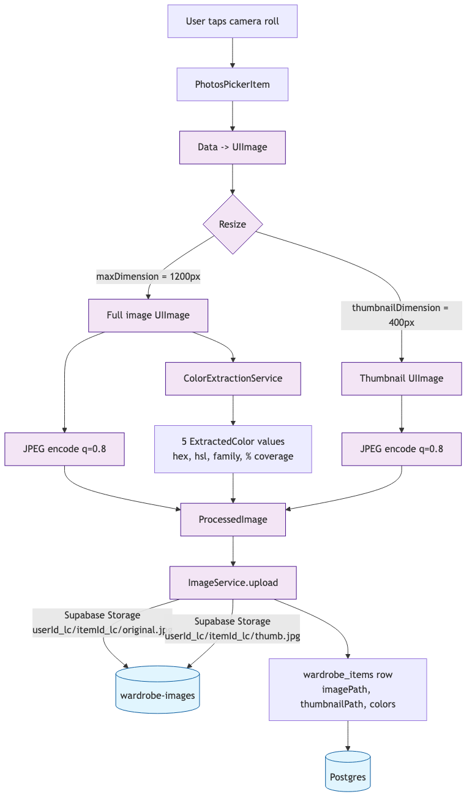
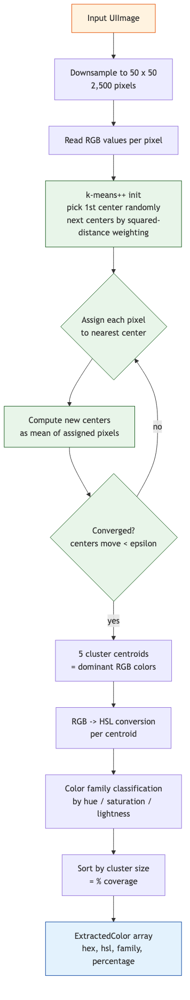
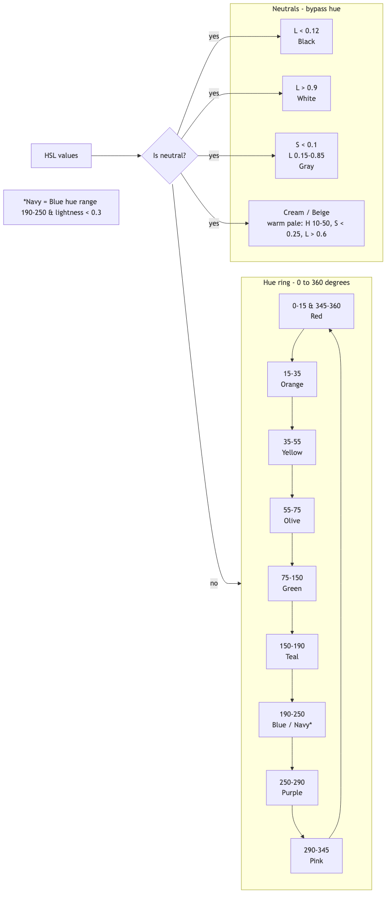
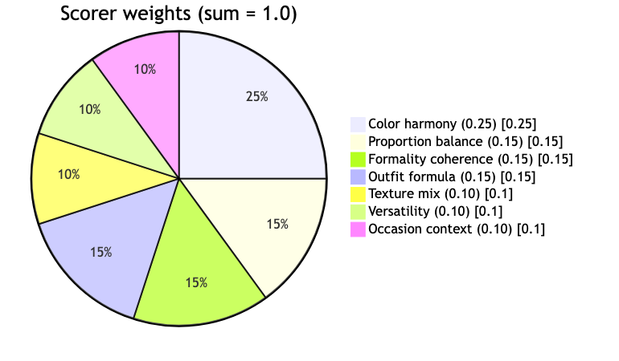
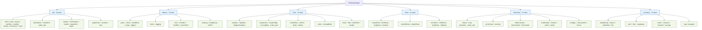
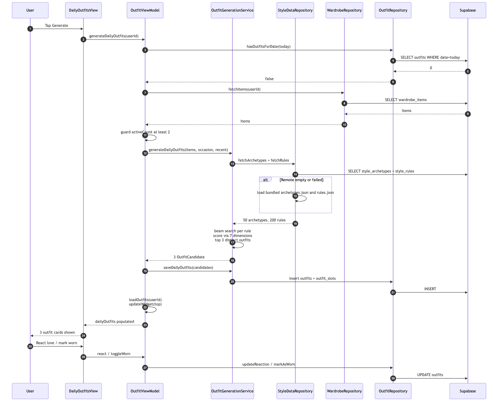
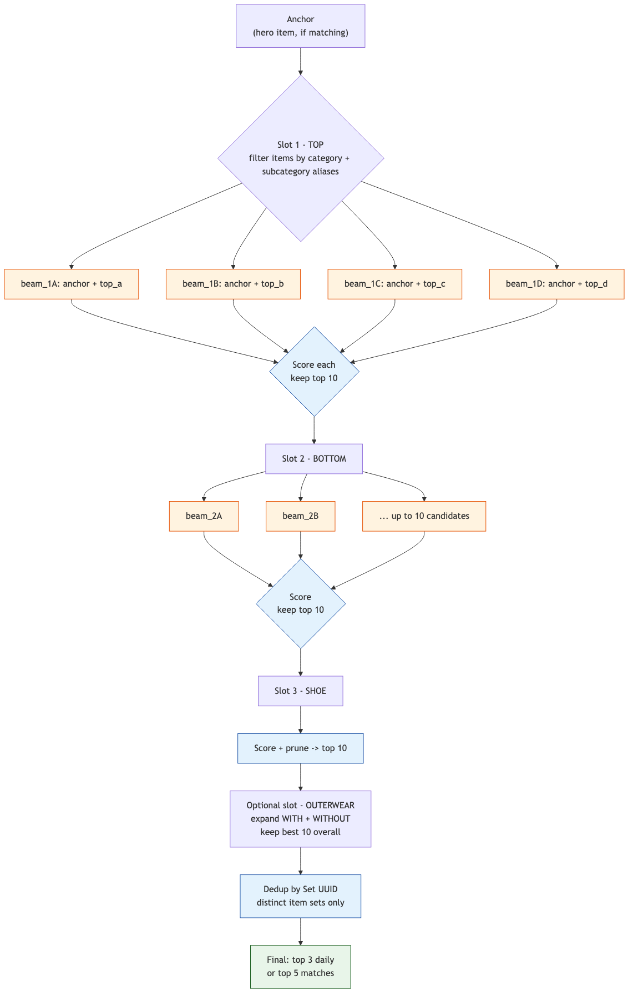

# 1. Overview

**Wardrobe Re-Do** is a native iOS app that helps you decide what to wear. It ingests photos of your clothing, extracts structured style metadata (color, texture, fit, formality), and runs a beam-search outfit generator over a library of 50 style archetypes and 200 combination rules. Every outfit is scored across seven independent dimensions rooted in professional fashion theory.

Two user-facing flows sit on top of the engine:

1. **Outfits tab — "Today's Outfits"**. One tap generates three styled outfits for the day given a chosen occasion (casual / work / date / formal / athletic / lounge). Results are stored per-day so they're stable across launches.
2. **Match tab — "What goes with this?"**. Pick a hero item from your wardrobe; the engine returns the five best outfits built around it.

## Design philosophy — the seven dimensions

Professional stylists evaluate outfits on many intersecting axes simultaneously. The engine encodes seven of them with explicit, replaceable scoring functions. Each dimension produces a score in `[0, 1]`; the final outfit score is a weighted sum, `Σ wᵢ · sᵢ`, with the weights summing to 1.0:

| Dimension | Weight | Intuition |
|---|---|---|
| Color harmony | 0.25 | 3-color max, 60-30-10 allocation, value contrast, coherent saturation |
| Proportion balance | 0.15 | Silhouette pairing — oversized+slim reads better than oversized+oversized |
| Formality coherence | 0.15 | Color brightness, texture smoothness, and structure move together |
| Outfit formula | 0.15 | Hero-piece method, 2-of-3 color match, third-piece rule |
| Texture mix | 0.10 | 2–3 textures optimal, visual weight balance |
| Versatility | 0.10 | Reward novel combinations; lightly penalize over-used items |
| Occasion context | 0.10 | Season, day of week, occasion appropriateness |

No single dimension dominates. Color harmony gets the largest slice because visual coherence is the single easiest way for an outfit to fail, but 75 % of the score still comes from other axes — which is why a boring monochromatic "safe" outfit can score lower than a bold three-color combination with great proportions.

## Stack at a glance

```
SwiftUI (iOS 17+, @Observable)
  ├── ViewModels (@MainActor)
  │   ├── OutfitGenerationService
  │   │   ├── 7 scorers
  │   │   └── Beam search
  │   ├── ColorExtractionService (CoreImage)
  │   └── ImageService (Supabase Storage)
  └── Repositories
      ├── Supabase Postgres + Storage
      └── Bundled JSON fallback (archetypes, rules)
```

Kingfisher is used for image caching on the view layer. SwiftData handles a small local cache. Dependencies are Swift Package Manager only.

---

# 2. Architecture

The app is MVVM + Repository + Service: views own no state beyond local UI bits, viewmodels own UI state and orchestrate services, services encapsulate domain logic, repositories handle I/O.


## Why this shape

- **ViewModels are thin orchestrators.** They hold `@Observable` state and `await` services. They don't know about Postgres or JSON.
- **Services are pure-ish domain logic.** `OutfitGenerationService` takes items + rules + context and returns candidates. It doesn't touch the network.
- **Repositories absorb data-layer variance.** `StyleDataRepository` hides the "try Supabase, fall back to bundled JSON" decision behind a simple `fetchArchetypes()` / `fetchRules()` API — every caller upstream sees one coherent dataset.
- **Protocols everywhere that matter.** `OutfitRepositoryProtocol`, `WardrobeRepositoryProtocol`, and `ImageServiceProtocol` make the VMs testable without hitting Supabase.

## Key directories

| Path | Purpose |
|---|---|
| `WardrobeReDo/App/` | Entry point, `AppState`, root `ContentView` |
| `WardrobeReDo/Config/` | `Constants` (Supabase), `Theme` (design tokens) |
| `WardrobeReDo/Models/` | Codable structs + enums |
| `WardrobeReDo/Services/` | ImageService, ColorExtractionService, OutfitGenerationService, WidgetDataService |
| `WardrobeReDo/Services/StyleEngine/` | 7 scoring dimensions + OutfitScorer |
| `WardrobeReDo/Repositories/` | Supabase data access + StyleDataRepository |
| `WardrobeReDo/ViewModels/` | One per feature — OutfitViewModel, MatchingViewModel, WardrobeViewModel, AddItemViewModel |
| `WardrobeReDo/Views/` | SwiftUI views grouped by feature domain |
| `WardrobeReDo/Resources/SeedData/` | `archetypes.json` (50), `rules.json` (200) |
| `supabase/migrations/` | Database schema + RLS policies |

## Concurrency model

- **Everything user-visible runs on `@MainActor`.** ViewModels and repositories are `@MainActor`-isolated; they can touch SwiftUI state directly.
- **Services are actor-agnostic and `Sendable`.** They can be called from any context.
- **Parallelism via `async let` and `withTaskGroup`.** The remote-fetch race in `StyleDataRepository.loadPaired` uses `async let`; the 60-second generation timeout uses `withTaskGroup`.

---

# 3. Image Processing Pipeline

Every photo a user adds walks through the same pipeline before it lands in the database. The goal: two JPEGs (full + thumbnail) stored in Supabase, plus an `ExtractedColor[]` array persisted on the wardrobe-item row.



## Constants — `ImageService.swift`

```swift
let maxDimension: CGFloat        = 1200   // full-size resize
let thumbnailDimension: CGFloat  = 400    // thumbnail resize
let jpegQuality: CGFloat         = 0.8    // 80 % compression
```

Both resizes are aspect-ratio-preserving; only the longer side is clamped to the target. JPEG q=0.8 keeps file sizes under ~300 KB for full images and ~30 KB for thumbnails, which is fast enough to upload over LTE and cheap enough that we don't need progressive loading on the detail view.

## `ProcessedImage`

The value object that bundles the result of processing:

```swift
struct ProcessedImage {
    let originalData: Data            // full-size JPEG
    let thumbnailData: Data           // thumbnail JPEG
    let dominantColors: [ExtractedColor]
}
```

`ExtractedColor` carries hex, HSL, color-family name (e.g. `navy`, `cream`), and `percentage` (coverage as a fraction of the 50×50 downsample).

## Storage convention

Uploads go to a **private** bucket called `wardrobe-images` with per-user folders:

```
{userId.lowercased()}/{itemId.lowercased()}/original.jpg
{userId.lowercased()}/{itemId.lowercased()}/thumb.jpg
```

The `lowercased()` is important — see section 11 for the Postgres RLS rule that made this a production bug at one point.

---

# 4. Color Extraction Algorithm

Color is the dimension the engine weighs most heavily, so color extraction has to be both fast and robust. The approach: downsample aggressively, cluster with k-means++, then classify each centroid into a named color family.



## Step 1 — Downsample

The image is drawn into a 50×50 `CGContext` (2,500 pixels). For a 1,200×1,600 source photo that's a 768× reduction. Clustering this tiny image is effectively free (<10 ms) and the color signal is preserved because the human eye also averages colors over regions.

## Step 2 — k-means++ initialization

Standard k-means is sensitive to initial centroid placement. k-means++ fixes this:

1. Pick the first center uniformly at random from the 2,500 pixels.
2. For each remaining pixel `x`, compute `D(x)` = distance to the nearest already-chosen center.
3. Pick the next center with probability proportional to `D(x)²` — far-away pixels are likelier to be chosen.
4. Repeat until you have `k = 5` centers.

This gives much better starting clusters than random init and makes 5 iterations usually enough to converge.

## Step 3 — Lloyd's iteration

Assign each pixel to its nearest center → compute new centers as the mean of their assigned pixels → repeat until movement is below a small epsilon.

## Step 4 — RGB → HSL conversion

The centroids are in RGB space, but classification needs HSL. The standard formula:

```
max = max(R, G, B) / 255
min = min(R, G, B) / 255
L = (max + min) / 2

if max == min:
    H = 0; S = 0
else:
    d = max - min
    S = d / (2 - max - min)     if L > 0.5
    S = d / (max + min)         if L <= 0.5
    if max is R: H = (G - B)/d + (if G < B: 6 else: 0)
    if max is G: H = (B - R)/d + 2
    if max is B: H = (R - G)/d + 4
    H *= 60   // convert to 0-360 degrees
```

## Step 5 — Color family classification

Each centroid is classified into one of 15 color families. Neutrals short-circuit the hue wheel; everything else is bucketed by hue range, with one special case (navy = dark blue).



### Neutral detection

```
isNeutral = S < 0.15  OR  L < 0.12  OR  L > 0.88
```

### Full classification table

| Family | Hue (°) | Saturation | Lightness | Notes |
|---|---|---|---|---|
| Black | any | any | L < 0.12 | priority — short-circuits |
| White | any | any | L > 0.9 | priority — short-circuits |
| Gray | any | S < 0.1 | 0.15 – 0.85 | low-saturation achromatic |
| Cream | 20 – 50 | S < 0.25 | L > 0.6 | warm pale |
| Beige | 10 – 30 | S < 0.25 | L > 0.6 | warm pale |
| Red | 0 – 15 or 345 – 360 | — | L > 0.12 | hue-driven |
| Orange | 15 – 35 | — | L > 0.12 | |
| Yellow | 35 – 55 | — | L > 0.12 | |
| Olive | 55 – 75 | — | L > 0.12 | |
| Green | 75 – 150 | — | L > 0.12 | |
| Teal | 150 – 190 | — | L > 0.12 | |
| Navy | 190 – 250 | — | L < 0.3 | special — dark blues are distinct |
| Blue | 190 – 250 | — | L ≥ 0.3 | |
| Purple | 250 – 290 | — | L > 0.12 | |
| Pink | 290 – 345 | — | L > 0.12 | |

## Step 6 — Rank by coverage

Sort centroids by the size of their cluster (= percentage of downsampled pixels). The first element is the dominant color; this is what the scoring engine treats as the "main" color of the item.

---

# 5. Texture, Fit, Formality

Color alone isn't enough — a black silk blouse and a black cotton t-shirt are the same color but pair very differently. Three more dimensions carry the load.

## Texture — `TextureType`

All 15 texture types declared in `Models/Enums/StyleEnums.swift`:

```
cotton, silk, denim, leather, suede, wool, linen, knit,
synthetic, velvet, satin, chiffon, tweed, corduroy, nylon
```

Each texture has a numeric `formalitySmoothness` score used by the Formality Coherence scorer. Smoother, drapier fabrics read as more formal; rougher, heavier fabrics read as more casual:

| Texture | Smoothness | Texture | Smoothness |
|---|---|---|---|
| silk | 9.0 | linen | 5.0 |
| satin | 9.0 | knit | 4.0 |
| chiffon | 8.0 | velvet | 4.0 |
| wool | 7.0 | nylon | 4.0 |
| tweed | 7.0 | synthetic | 4.0 |
| leather | 6.0 | denim | 3.0 |
| suede | 6.0 | corduroy | 3.0 |
| cotton | 5.0 | | |

## Visual weight — `VisualWeight`

Three buckets, derived from texture:

- **Light** — silk, chiffon, satin, nylon
- **Medium** — cotton, linen, synthetic
- **Heavy** — denim, leather, suede, wool, knit, velvet, tweed, corduroy

The Texture Mix scorer rewards "mixed visual weight" outfits (e.g. a heavy denim jacket with a light silk blouse) and penalizes head-to-toe heavy-only combinations, which read as overloaded.

## Fit — `FitAttribute`

Six cases: `oversized`, `relaxed`, `regular`, `slim`, `structured`, `cropped`. These feed the Proportion Balance scorer, which knows which pairings work:

- Allowed by default: `structured / slim`, `regular / slim`, `cropped / regular`
- Discouraged by default: `oversized / oversized`, `oversized / relaxed`
- Archetype-specific: a rule can declare its own `allowed` and `forbidden` pairs that override the default.

## Formality

Formality is **multi-dimensional**. The `FormalityCoherenceScorer` builds a per-item formality score from:

- Color brightness — darker and more muted → more formal
- Texture smoothness — from the table above
- Structure — `structured` fit is more formal than `relaxed`; tailored items (blazer, dress shirt, dress pants) read more formal than their casual counterparts
- Pattern — solids over prints

The outfit's coherence score is then `1 − σ(perItemFormality)`. An outfit where every item is 0.8 formality reads coherent; one mixing 0.2 sneakers with a 0.9 tuxedo reads incoherent.

---

# 6. The Seven Scorers

Each scorer lives in its own file under `Services/StyleEngine/`. They all conform to a common shape: take the outfit (items + slot assignments), take a `ScoringContext` (season, occasion, recent items, archetype, rule), return a score in `[0, 1]`.



## 6.1 Proportion Balance (w = 0.15)

**File:** `ProportionBalanceScorer.swift`

Scores silhouette pairing. The input is the fit of each item (top fit vs bottom fit, etc.); the output is driven by:

1. **Archetype preference match.** If the archetype declares `preferred_balances: [["regular", "slim"]]`, outfits matching that pattern get a boost.
2. **Rule constraints.** Rules can explicitly `forbid` pairs (e.g. `["oversized", "relaxed"]`) — a match drops the score sharply.
3. **Default balance.** In the absence of archetype/rule guidance, pairs like `oversized + slim` score well; `oversized + oversized` scores poorly.

## 6.2 Color Harmony (w = 0.25)

**File:** `ColorHarmonyScorer.swift`

The heaviest scorer. Multiple sub-rules combine:

- **3-color max rule.** Outfits with ≤ 3 distinct color families score highest. Each additional family costs points.
- **60-30-10 allocation.** Dominant color around 60 % of visual mass, secondary ~30 %, accent ~10 %. Approximated via coverage percentages across items.
- **Value contrast.** At least two different lightness bands (dark / medium / light) in the outfit. Monochromatic outfits still score OK but don't get the value-contrast bonus.
- **Saturation coherence.** All items should be in roughly the same saturation band — mixing a pastel pink with a deep saturated red reads off.
- **Harmony type.** Detects monochromatic / analogous / complementary / triadic / neutral harmony and cross-references against the rule's `preferred_harmony`.

## 6.3 Texture Mix (w = 0.10)

**File:** `TextureMixScorer.swift`

- **2–3 distinct textures optimal.** 1 = flat; 4+ = noisy.
- **Visual weight balance.** Bonus for mixing heavy + light (e.g. denim + silk); penalty for all-heavy or all-light.
- **Formality smoothness coherence.** All smoothness values should cluster — a 9.0 silk blouse with a 3.0 denim jean is fine as a deliberate contrast, but a 9.0 / 3.0 / 8.0 / 4.0 outfit reads scattered.

## 6.4 Formality Coherence (w = 0.15)

**File:** `FormalityCoherenceScorer.swift`

Per-item formality from color brightness, texture smoothness, pattern, and structure (as described in Section 5). Coherence = `1 − σ(per-item formality)`. The closer the items cluster around a single formality level, the higher the score.

## 6.5 Outfit Formula (w = 0.15)

**File:** `OutfitFormulaScorer.swift`

Encodes four classical formula heuristics:

1. **Hero-piece method.** One item is visually dominant (most saturated or outerwear) — other items support it.
2. **2-of-3 color matching.** At least two items share a color family.
3. **Third-piece rule.** A jacket or cardigan adds visual interest; the third-piece bonus rewards outfits that include one.
4. **Slot-requirement satisfaction.** Every `is_required: true` slot must be filled; partial fills are penalized.

## 6.6 Versatility (w = 0.10)

**File:** `VersatilityScorer.swift`

- **Frequency penalty.** Items that appeared in recent outfits are lightly down-weighted. `outfitRepository.fetchRecentItemIds(userId:, days: 7)` feeds this.
- **Novel combination bonus.** Outfits whose item-set hasn't been seen before get a small boost.

## 6.7 Occasion Context (w = 0.10)

**File:** `OccasionContextScorer.swift`

- **Season fit.** Rule `penalty_conditions.avoid_seasons` drops the score if the current season is listed.
- **Occasion fit.** Rule `penalty_conditions.avoid_occasions` does the same for occasion.
- **Boosts.** `boost_conditions.seasonal_boosts` and `day_of_week_boosts` add small multipliers for context match (e.g. a rule boosted for Monday-Friday will outrank an equivalent casual rule on a workday).

## Description generation

After scoring, the generator attaches an editorial description (one sentence shown on the outfit card). Thresholds are explicit:

```
score >= 0.75  →  "A standout combination"
score >= 0.55  →  "A well-balanced look"
score <  0.55  →  "An interesting pairing"
```

---

# 7. Style Data — Archetypes and Rules

The engine's taste is encoded in two datasets: **archetypes** (50) and **rules** (200). An archetype is a named look (`timeless_tailored`, `saturday_refined`); a rule is a specific slot configuration that expresses that look (e.g. "dress shirt + dress pants + oxford or derby").

## Archetype schema — `StyleArchetype.swift`

| Field | Type | Example |
|---|---|---|
| `id` | UUID | `A0000001-0000-0000-0000-000000000001` |
| `name` | String | `timeless_tailored` |
| `family` | String | `classic` |
| `editorialName` | String | `The Tailored Line` |
| `description` | String | `Crisp, structured silhouettes…` |
| `formalityMin` / `formalityMax` | Double / Double | `0.5` / `0.85` |
| `seasons` | [String] | `["spring", "fall", "winter"]` |
| `occasions` | [String] | `["work", "date", "formal"]` |
| `moodKeywords` | [String] | `["polished", "confident", "refined"]` |
| `colorPreferences` | optional | harmonies, avoid combos, neutral bias |
| `texturePreferences` | optional | preferred / avoided textures, max count |
| `proportionPreferences` | optional | preferred balances, allow oversized |

## Rule schema — `StyleRule.swift`

| Field | Type | Notes |
|---|---|---|
| `id` | UUID | PK |
| `archetypeId` | UUID | FK to `style_archetypes` |
| `slotRequirements` | [SlotRequirement] | The meat of the rule |
| `weight` | Double | Rule-level multiplier |
| `boostConditions` | optional | seasonal + day-of-week boosts |
| `penaltyConditions` | optional | avoid_seasons, avoid_occasions |
| `preferredHarmony` | String | e.g. `"complementary"` |
| `proportionRule` | optional | topFit / bottomFit / allowed / forbidden |
| `textureRule` | optional | min / max textures, required contrast |

A `SlotRequirement` looks like:

```json
{
  "category": "top",
  "subcategories": ["dress_shirt", "button_down"],
  "is_required": true
}
```

`category` is a coarse bucket (`top`, `bottom`, `shoe`, `dress`, `outerwear`, `accessory`); `subcategories` is an optional whitelist in the fine-grained snake_case vocabulary (see Section 8).

## The archetype-rule pairing contract

Every `rule.archetypeId` must reference a real `archetype.id` from the **same source** (remote or bundled — never mixed). `StyleDataRepository.loadPaired()` enforces this:

1. Fetch remote archetypes and remote rules in parallel.
2. If **both** are non-empty → use them.
3. Otherwise → fall back to bundled JSON for **both** (never remote archetypes + bundled rules).

This prevents a subtle class of bugs where the DB has archetypes but not rules (or vice versa) and the FKs all dangle.

---

# 8. Subcategory Taxonomy and Aliases

The app has two competing subcategory vocabularies, and bridging them is what unblocks generation for small wardrobes.



## The two vocabularies

- **Swift enum `ClothingSubcategory`** — what users pick at item-add time. Historically camelCase: `tshirt`, `buttonDown`, `sneakers`, `dressShoes`.
- **`rules.json` subcategory strings** — fine-grained snake_case: `button_down`, `dress_shirt`, `sneaker_low`, `sneaker_high`, `running_shoe`, `oxford`, `derby`.

A user who adds a pair of Nike Air Force 1s picks `sneakers` from the picker. The rule engine sees a required slot needing `sneaker_low`. Without a bridge, that item never satisfies the slot → zero candidates → empty outfit generation.

## The bridge — `SubcategoryAliases.swift`

A single static dictionary `itemMatches: [String: Set<String>]` maps each Swift `rawValue` to the set of rule-subcategory strings it satisfies. The key helper:

```swift
static func matches(itemSubcategory: String, requiredSubcategory: String) -> Bool {
    if itemSubcategory == requiredSubcategory { return true }
    return itemMatches[itemSubcategory]?.contains(requiredSubcategory) ?? false
}
```

Identity match wins first (cheap). Alias lookup second.

Illustrative entries:

```
"sneakers"     → ["sneaker_low", "sneaker_high", "running_shoe",
                  "athletic_shoe", "trainer", "tennis_shoe"]
"dressShoes"   → ["oxford", "derby", "loafer", "dress_shoe",
                  "monk_strap", "wholecut"]
"buttonDown"   → ["button_down", "dress_shirt", "oxford",
                  "shirt_jacket"]
"blazer"       → ["blazer", "suit_jacket", "sport_coat"]
"winterCoat"   → ["overcoat", "winter_coat", "wool_coat"]
```

The alias map is called from three sites inside `OutfitGenerationService`:

1. `findMatchingItems(for:in:)` — resolves slot requirements against the wardrobe.
2. `matchOutfits` → `heroFitsRule` — decides whether a hero piece is compatible with a given rule.
3. `beamSearchWithAnchor` — when the anchor fills a slot, the slot is removed from the remaining requirements.

## Soft category-only fallback

Even with aliases, a 3-item wardrobe might not have any item that fits the fine-grained subcategory. Rather than hard-failing, `findMatchingItems` falls back to any item in the right category:

```swift
return aliasMatched.isEmpty ? categoryItems : aliasMatched
```

The scorers still reward better subcategory fits via `OutfitFormulaScorer`, but small wardrobes never hit "zero candidates" for a subcategory-vocabulary mismatch alone.

## Enum expansion (2026-04-17)

The Swift enum was also expanded so new users can pick precise subcategories at add-item time. Counts after expansion:

| Category | Cases | Includes new snake_case |
|---|---:|---|
| Top | 18 | `dress_shirt`, `knit_sweater`, `sweatshirt`, `camisole`, `tank` |
| Bottom | 14 | `leggings`, `pencil_skirt` |
| Shoe | 16 | `sneaker_low`, `sneaker_high`, `running_shoe`, `oxford`, `derby`, `ballet_flat` |
| Dress | 10 | `midi_dress`, `sundress`, `slip_dress`, `sheath_dress` |
| Outerwear | 13 | `suit_jacket`, `overcoat`, `shirt_jacket` |
| Accessory | 13 | `hat` |
| **Total** | **84** | |

Existing camelCase rawValues (`tshirt`, `buttonDown`, `sneakers`) are unchanged — renaming would orphan rows already written to Postgres. The alias map handles the bridging for those.

---

# 9. Outfit Generation Pipeline

The Outfits tab's "Generate Today's Outfits" flow is the most complex path in the app. At a high level: fetch archetypes and rules, filter to ones that fit the wardrobe and occasion, beam-search over each, score, deduplicate, return the top three.



## Constants

```swift
let beamWidth: Int          = 10   // candidates kept per slot expansion
let dailyOutfitCount: Int   = 3    // final outfits per day
let matchResultCount: Int   = 5    // results for the Match tab
```

## Top-level flow — `generateDailyOutfits`

1. **Guard: already generated today?** `outfitRepository.hasOutfitsForDate(...)` short-circuits so users don't double-generate.
2. **Pre-check wardrobe size.** With fewer than 2 active items, surface `GenerationFailure.wardrobeTooSmall(count)` — this produces actionable empty-state copy instead of a generic timeout message.
3. **Race against a 60-second timeout.** `withTaskGroup(of: GenerationOutcome.self)` runs generation in one child task and `Task.sleep(for: .seconds(60))` in another. First to finish wins; the rest are cancelled.
4. **Outcome handling.** The result is one of:
   - `.success` → reload outfits, update the home-screen widget with the top one.
   - `.empty` → `GenerationFailure.noCompatibleOutfits` (wardrobe has items but no combinations score).
   - `.timeout` → `GenerationFailure.networkTimeout`.
   - `.error(msg)` → `GenerationFailure.unknown(msg)`.

Each failure variant produces reason-specific copy and a Try-Again button in `DailyOutfitsView`.

## Beam search — `beamSearchWithAnchor`

The core algorithm. Given a rule with N slot requirements, enumerate item combinations that satisfy them, scoring as you go and keeping only the top-k candidates at each step.



**Pseudocode:**

```
function beamSearch(rule, items, anchor):
    # Anchor is pre-placed (e.g. hero item in Match mode)
    # Its slot is removed from the requirement list.
    slots = rule.slotRequirements
    if anchor:
        slots.removeFirst(where: anchor fits slot)

    beam = [[anchor]] if anchor else [[]]

    for slot in slots where slot.isRequired:
        candidates = findMatchingItems(for: slot, in: items)
        new_beam = []
        for base in beam:
            for item in candidates:
                new_beam.append(base + [item])
        score each candidate in new_beam
        sort new_beam by score descending
        beam = new_beam[:beamWidth]
        if beam.isEmpty: return []  # unsatisfiable

    for slot in slots where !slot.isRequired:
        candidates = findMatchingItems(for: slot, in: items)
        new_beam = []
        for base in beam:
            new_beam.append(base)              # keep without
            for item in candidates:
                new_beam.append(base + [item]) # keep with
        score, sort, truncate to beamWidth
        beam = new_beam

    return beam
```

The trick is that "keep both with and without" for optional slots doubles the branching factor for one step only, but the beam-width cap keeps memory bounded.

## Hero piece selection

Daily generation runs without a forced hero, but the UI still shows a "hero" on the card — the item that's visually dominant. Selection logic:

1. First outerwear item → hero (coats and jackets visually anchor).
2. Otherwise, first dress item → hero.
3. Otherwise, the item with the highest dominant-color saturation → hero.

## Dedup

After every beam expansion for every rule, candidates are collected into a flat list. Before returning the top-N, the list is deduped by item-set identity:

```swift
var seen: Set<Set<UUID>> = []
for candidate in sortedByScore {
    let key = Set(candidate.items.map(\.id))
    if !seen.contains(key) {
        seen.insert(key)
        result.append(candidate)
        if result.count == dailyOutfitCount { break }
    }
}
```

Outfits that differ only in slot ordering are considered identical.

## Persistence

Successful generation calls `generationService.saveDailyOutfits(candidates:userId:)`, which does two inserts per outfit:

- `outfits` row — editorial name, description, total score, score breakdown (per-dimension JSON)
- `outfit_slots` rows — one per (outfit, item, slot) triple

Both are reloaded on the next `loadOutfits(userId:)` call; the ViewModel then caches thumbnail URLs and pushes the top outfit to the home-screen widget.

---

# 10. Matching Algorithm

The Match tab uses the same beam search but with two differences: a forced **anchor** item (the hero) and different top-N bookkeeping.

## Flow — `matchOutfits`

1. User picks a hero item → `selectItem(item, userId:)` auto-triggers `findMatches(userId:)`.
2. Pre-check: wardrobe has at least one non-hero supporting item — if not, set `GenerationFailure.wardrobeTooSmall`.
3. Fetch archetypes + rules from `StyleDataRepository`.
4. For each archetype, for each rule:
   - `heroFitsRule(rule, hero)` → does the rule have a slot this item can fill?
   - If yes → `beamSearchWithAnchor(anchor: hero, rule: rule, items: wardrobe)`.
   - Keep the top 2 candidates per rule.
5. Flatten, dedup by item-set, keep top 5 by score.

## `heroFitsRule`

```swift
let heroFitsRule = rule.slotRequirements.contains { req in
    guard req.category == heroItem.category.rawValue else { return false }
    guard let subs = req.subcategories, !subs.isEmpty else { return true }
    return subs.contains { sub in
        SubcategoryAliases.matches(
            itemSubcategory: heroItem.subcategory.rawValue,
            requiredSubcategory: sub
        )
    }
}
```

The category check is cheap; it's the subcategory alias check that makes this work for wardrobes with coarse-grained tags.

## Save a match as an outfit

Match results are transient by default — they live in `MatchingViewModel.matchResults` and disappear when the user selects a different hero. Tapping the save icon on a result card calls `saveAsOutfit(at:userId:)`, which writes the outfit through the same `saveDailyOutfits` code path used by the Outfits tab.

---

# 11. Data Sources and Fallback

Two classes of data backing the engine: user-specific (wardrobe items, outfits, reactions) and shared style knowledge (archetypes, rules). The user data lives only in Supabase. The style data is dual-sourced.

## The paired-fallback rule

`StyleDataRepository.loadPaired()`:

```swift
private func loadPaired() -> (archetypes, rules) {
    // 1. Try Supabase in parallel
    async let remoteArchetypes: [StyleArchetype]? = fetchRemote("style_archetypes")
    async let remoteRules: [StyleRule]? = fetchRemote("style_rules")
    let a = await remoteArchetypes
    let r = await remoteRules

    // 2. Use remote IFF BOTH are non-empty
    if let a, !a.isEmpty, let r, !r.isEmpty { return (a, r) }

    // 3. Otherwise fall back to bundled JSON for BOTH (never mixed)
    let bundledA: [StyleArchetype] = loadBundled("archetypes")
    let bundledR: [StyleRule] = loadBundled("rules")
    return (bundledA, bundledR)
}
```

**Why both-or-neither.** Rules reference archetypes by UUID. If you use remote archetypes (12) with bundled rules (200), every rule's `archetypeId` dangles because bundled UUIDs don't exist in the remote table. The generation service filters these out and returns zero candidates.

## Lessons learned — the bundled-JSON decoder bug

Two subtle bugs bit the fallback path simultaneously. Both were surfaced by the same user-visible symptom ("Generation timed out or failed") and both were fixed as part of the same sweep:

### 1. `convertFromSnakeCase` conflicts with explicit `CodingKeys`

Original code:

```swift
let decoder = JSONDecoder()
decoder.keyDecodingStrategy = .convertFromSnakeCase   // <- problem
return try decoder.decode([T].self, from: data)
```

`StyleArchetype` and `StyleRule` both declare explicit `CodingKeys` with snake_case `rawValues`:

```swift
case editorialName = "editorial_name"
case archetypeId   = "archetype_id"
```

With `convertFromSnakeCase` active, `JSONDecoder` first rewrites `editorial_name` → `editorialName` internally, then tries to match against the CodingKey `rawValue`, which is still `"editorial_name"`. Result: `keyNotFound("editorial_name")`. Bundled decode returned 0 archetypes silently.

**Fix:** remove the strategy line. The explicit `CodingKeys` already carry the snake_case mapping.

### 2. Rule IDs with non-hex prefix

`rules.json` used semantic prefixes: `R0000001-…` for rules and `A0000001-…` for archetypes. `A` is valid hex; `R` is not. `UUID(uuidString: "R0000001-…")` returns `nil`, so `[StyleRule]` decode failed with `dataCorrupted ... UUID from invalid UUID string` on the first entry.

**Fix:** rewrite all 200 rule IDs from the `R` prefix to the `F` prefix (valid hex, visually distinct from the `A`-prefixed archetype IDs) via a scripted find-and-replace. Archetype IDs were already valid.

### The combined effect

Before the fix, production logs would show:

```
Falling back to bundled style data
(remote archetypes: 12, remote rules: 0).
Bundled: 0 archetypes, 0 rules.
```

0 + 0 rules → 0 candidates → beam search returns empty → task group reports `.empty` → user sees "Generation timed out or failed. Please try again."

After the fix:

```
Falling back to bundled style data
(remote archetypes: 12, remote rules: 0).
Bundled: 50 archetypes, 200 rules.
```

50 × 200 rules are searched, candidates are scored, 3 outfits land on the screen. The alias-map fix (Section 8) layers on top of this — even with the rules loaded, a user's coarse-tagged `sneakers` wouldn't satisfy a `sneaker_low` slot without the bridge.

---

# 12. Storage and RLS

## Private bucket — `wardrobe-images`

Defined in `supabase/migrations/00001_initial_schema.sql`. Private by default (no anonymous reads). Access policy:

```sql
CREATE POLICY "wardrobe-images user folder access" ON storage.objects
FOR ALL USING (
    bucket_id = 'wardrobe-images'
    AND auth.uid()::text = (storage.foldername(name))[1]
);
```

The first path segment must match the authenticated user's UUID (as text). Any mismatch → 403.

## The lowercase-UUID lesson

`auth.uid()` returns the user's UUID in the Postgres canonical form: **lowercase** hex. `UUID.uuidString` in Swift returns **uppercase** hex.

If the app uploads to `B1F3...A9C8/item/original.jpg` (uppercase) and Postgres evaluates `auth.uid()::text == 'b1f3...a9c8'`, the policy check fails silently — the upload gets a 403, which surfaces as "Failed to save item" on the wardrobe screen.

**The fix that's now permanent:**

```swift
let path = "\(userId.uuidString.lowercased())/\(itemId.uuidString.lowercased())/original.jpg"
```

Every write and read uses `lowercased()`. It's worth a one-line comment at every call site because the next engineer might "tidy up" by removing the lowercased call.

## Database tables

| Table | Rows | Purpose |
|---|---|---|
| `profiles` | 1 per user | Extends `auth.users` with style preferences |
| `wardrobe_items` | many per user | Clothing — colors, texture, fit, formality |
| `style_archetypes` | 50 reference | Shared style knowledge |
| `style_rules` | 200 reference | Outfit combination rules |
| `outfits` | many per user | Generated outfits — score breakdown, reaction, worn flag |
| `outfit_slots` | one per slot | `(outfit_id, item_id, slot_role)` |
| `item_style_tags` | many per item | Auto-applied and user-applied tags |

Each user-owned table has an RLS policy of the form `user_id = auth.uid()` so no row-sharing leaks across accounts.

## Indexing strategy

- `wardrobe_items (user_id, category)` — powers the wardrobe list.
- `outfits (user_id, date DESC)` — powers "today's outfits" queries.
- `outfit_slots (outfit_id)` — powers slot resolution.
- `item_style_tags (item_id)` — tag lookups.

## Widget storage

`WidgetDataService.updateWidget(...)` pushes three keys to the App Group UserDefaults suite `group.com.digitalatelier.wardroberedo`:

```
widget_outfit_name   String   // "The Tailored Line"
widget_outfit_score  Int      // 82
widget_outfit_items  Int      // 4
```

After writing, it calls `WidgetCenter.shared.reloadAllTimelines()`. The widget extension reads the same keys on its next timeline refresh.

---

# 13. Known Limitations and Future Work

## Automated visual inference

Texture, fit, structure, and subcategory are user-input today. A CoreML or Vision-based classifier would:

1. Auto-tag texture from image patches (denim, wool, silk, ...).
2. Infer fit from silhouette analysis against a pose estimate.
3. Suggest subcategory from a ResNet/CLIP-style classifier.

The scoring engine is structured so these can be swapped in without touching the scorers — tagging just changes where the data comes from.

## Remote `style_rules` population

The migration `supabase/migrations/00002_seed_style_data.sql` scaffolds the remote-rules table but isn't run on the live DB. The bundled fallback reliably serves 50 archetypes + 200 rules today, so there's no user-facing reason to migrate — but populating the DB would let us ship new rules without an app update.

## Tests for the alias map

`SubcategoryAliases.matches()` needs property-based tests: for every key `k` in `itemMatches`, for every element `v` in `itemMatches[k]`, `matches(k, v) == true`. And the inverse: pick a few arbitrary unrelated pairs and assert `false`. Adding these would catch future accidental deletions.

## Outfit-quality telemetry

User reactions (❤️ / 👍 / ⏭️) and "marked as worn" are already captured. A retraining loop that re-weights the 7 scorer dimensions against each user's history would make the engine personal over time. Needs privacy review first.

## Subcategory CHECK constraint

`wardrobe_items.subcategory` is a free-form `TEXT` column in Postgres. A `CHECK subcategory IN ('tshirt', 'buttonDown', ...)` would fail-fast on bad writes. Requires a migration with explicit enum enumeration; deferred until the Swift enum stabilizes.

## Error telemetry

The new `GenerationFailure` enum lets the UI show reason-specific copy, but the reasons aren't telemetered. A counter per variant in production logs would let us see whether "noCompatibleOutfits" is a small-wardrobe issue (fixable by add-items nudge) or a rule-coverage gap (fixable by more rules).

---

# Appendix A — Key File Paths

| File | Purpose |
|---|---|
| `WardrobeReDo/Services/ImageService.swift` | Resize, JPEG encode, upload |
| `WardrobeReDo/Services/ColorExtractionService.swift` | k-means + HSL + color family classify |
| `WardrobeReDo/Services/OutfitGenerationService.swift` | Beam search, hero selection, dedup |
| `WardrobeReDo/Services/StyleEngine/OutfitScorer.swift` | Weighted sum of the 7 dimensions |
| `WardrobeReDo/Services/StyleEngine/*Scorer.swift` | One file per dimension |
| `WardrobeReDo/Services/WidgetDataService.swift` | App Group UserDefaults + reload |
| `WardrobeReDo/Repositories/StyleDataRepository.swift` | Paired remote + bundled fallback |
| `WardrobeReDo/Models/Enums/ClothingSubcategory.swift` | 84 subcategory cases |
| `WardrobeReDo/Models/Enums/SubcategoryAliases.swift` | Bridge enum ↔ rules.json strings |
| `WardrobeReDo/Models/Enums/StyleEnums.swift` | TextureType, FitAttribute, VisualWeight, Season, Occasion |
| `WardrobeReDo/Models/StyleArchetype.swift` | Archetype schema |
| `WardrobeReDo/Models/StyleRule.swift` | Rule schema + sub-structs |
| `WardrobeReDo/ViewModels/OutfitViewModel.swift` | Daily generation orchestration |
| `WardrobeReDo/ViewModels/MatchingViewModel.swift` | Hero-piece matching orchestration |
| `WardrobeReDo/ViewModels/GenerationFailure.swift` | Reason-specific failure enum |
| `WardrobeReDo/Resources/SeedData/archetypes.json` | 50 archetypes (A-prefix UUIDs) |
| `WardrobeReDo/Resources/SeedData/rules.json` | 200 rules (F-prefix UUIDs) |
| `supabase/migrations/00001_initial_schema.sql` | Tables + bucket policy |

# Appendix B — Scorer Weight Reference

```
proportionBalance    0.15
colorHarmony         0.25
textureMix           0.10
formalityCoherence   0.15
outfitFormula        0.15
versatility          0.10
occasionContext      0.10
                    -----
                     1.00
```

# Appendix C — Generation Failure Reference

Defined in `WardrobeReDo/ViewModels/GenerationFailure.swift`:

| Case | User-facing message |
|---|---|
| `wardrobeTooSmall(0)` | "Add a few items to start generating outfits." |
| `wardrobeTooSmall(1)` | "Add at least one more item — outfits need at least two pieces." |
| `noCompatibleOutfits` | "We couldn't build any outfits with your current wardrobe. Try a different occasion, or add more variety." |
| `networkTimeout` | "The connection is slow. Tap Try Again." |
| `unknown(msg)` | "Something went wrong: {msg}. Tap Try Again." |

Views render the message plus a Try-Again button when `lastFailure != nil`.
